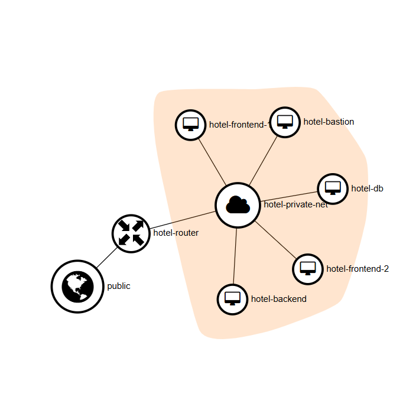
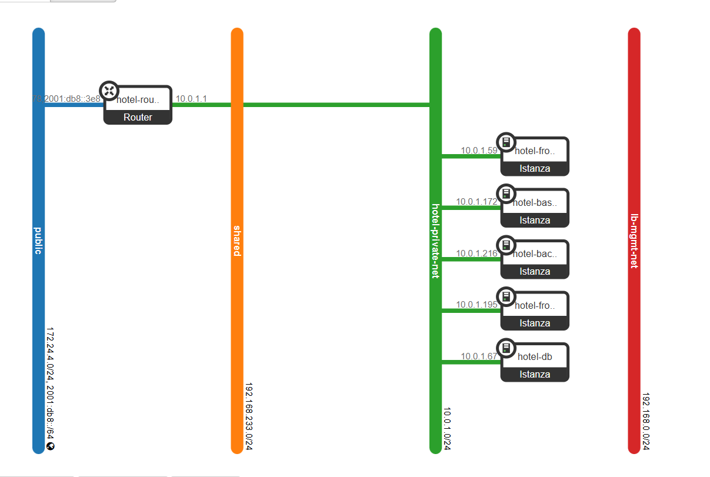

# Requirements GPT 5-2

Facendo il `terraform plan`:

```text
╷
│ Error: Your query returned no results. Please change your search criteria and try again.
│ 
│   with data.openstack_images_image_v2.cirros,
│   on images.tf line 12, in data "openstack_images_image_v2" "cirros":
│   12: data "openstack_images_image_v2" "cirros" {
│ 
╵
```

In `images.tf` troviamo il seguente blocco `data`:

```terraform
data "openstack_images_image_v2" "cirros" {
  name        = var.cirros_image_name
  most_recent = true
}
```

Dobbiamo semplicemente aggiornare il contenut della variabile `cirros_image_name`.

```diff
diff --git a/app-demo/terraform/output/variables.tf b/app-demo/terraform/output/variables.tf
index c54f5bd..322522c 100644
--- a/app-demo/terraform/output/variables.tf
+++ b/app-demo/terraform/output/variables.tf
@@ -13,7 +13,7 @@ variable "jammy_image_source_url" {
 variable "cirros_image_name" {
   type        = string
   description = "Existing Cirros image name in Glance."
-  default     = "cirros"
+  default     = "cirros-0.6.3-x86_64-disk"
 }
 
 variable "ssh_private_key_path" {
```

Il `terraform plan` non da errori: proviamo a fare un `terraform apply`.

```text
openstack_lb_listener_v2.http: Creation complete after 2s [id=0a4e228e-542b-4453-a8eb-626cb3af5721]
openstack_lb_pool_v2.frontend: Creating...
openstack_lb_pool_v2.frontend: Creation complete after 1s [id=0233f8b6-d9c7-4001-b4bf-dfb8310b780c]
openstack_lb_monitor_v2.tcp: Creating...
openstack_lb_monitor_v2.tcp: Creation complete after 2s [id=8f93b107-09ea-4713-9e27-5eac773b5e40]
openstack_images_image_v2.ubuntu_jammy: Still creating... [00m20s elapsed]
openstack_images_image_v2.ubuntu_jammy: Still creating... [00m30s elapsed]
openstack_images_image_v2.ubuntu_jammy: Still creating... [00m40s elapsed]
openstack_images_image_v2.ubuntu_jammy: Still creating... [00m50s elapsed]
openstack_images_image_v2.ubuntu_jammy: Still creating... [01m00s elapsed]
openstack_images_image_v2.ubuntu_jammy: Still creating... [01m10s elapsed]
openstack_images_image_v2.ubuntu_jammy: Still creating... [01m20s elapsed]
openstack_images_image_v2.ubuntu_jammy: Still creating... [01m30s elapsed]
openstack_images_image_v2.ubuntu_jammy: Still creating... [01m40s elapsed]
openstack_images_image_v2.ubuntu_jammy: Still creating... [01m50s elapsed]
openstack_images_image_v2.ubuntu_jammy: Still creating... [02m00s elapsed]
openstack_images_image_v2.ubuntu_jammy: Still creating... [02m10s elapsed]
openstack_images_image_v2.ubuntu_jammy: Still creating... [02m20s elapsed]
openstack_images_image_v2.ubuntu_jammy: Still creating... [02m30s elapsed]
openstack_images_image_v2.ubuntu_jammy: Still creating... [02m40s elapsed]
openstack_images_image_v2.ubuntu_jammy: Creation complete after 2m41s [id=16123fa8-d29d-481d-aba3-4a37c343c2bf]
╷
│ Error: Error creating openstack_compute_flavor_v2 hotel_flavor: Expected HTTP response code [200 201] when accessing [POST http://192.168.1.13/compute/v2.1/flavors], but got 403 instead: {"forbidden": {"code": 403, "message": "Policy doesn't allow os_compute_api:os-flavor-manage:create to be performed."}}
│ 
│   with openstack_compute_flavor_v2.hotel_flavor,
│   on compute.tf line 1, in resource "openstack_compute_flavor_v2" "hotel_flavor":
│    1: resource "openstack_compute_flavor_v2" "hotel_flavor" {
│ 
╵
╷
│ Error: Invalid index
│ 
│   on env.tf line 5, in locals:
│    5:   bastion_private_ip = openstack_networking_port_v2.bastion.all_fixed_ips[0]
│     ├────────────────
│     │ openstack_networking_port_v2.bastion.all_fixed_ips is empty list of string
│ 
│ The given key does not identify an element in this collection value: the collection has no elements.
╵
╷
│ Error: Invalid index
│ 
│   on env.tf line 6, in locals:
│    6:   backend_private_ip = openstack_networking_port_v2.backend.all_fixed_ips[0]
│     ├────────────────
│     │ openstack_networking_port_v2.backend.all_fixed_ips is empty list of string
│ 
│ The given key does not identify an element in this collection value: the collection has no elements.
╵
╷
│ Error: Invalid index
│ 
│   on env.tf line 9, in locals:
│    9:     for p in openstack_networking_port_v2.frontend : p.all_fixed_ips[0]
│     ├────────────────
│     │ p.all_fixed_ips is empty list of string
│ 
│ The given key does not identify an element in this collection value: the collection has no elements.
╵
╷
│ Error: Invalid index
│ 
│   on env.tf line 9, in locals:
│    9:     for p in openstack_networking_port_v2.frontend : p.all_fixed_ips[0]
│     ├────────────────
│     │ p.all_fixed_ips is empty list of string
│ 
│ The given key does not identify an element in this collection value: the collection has no elements.
╵
╷
│ Error: Error associating openstack_networking_floatingip_associate_v2 floating_ip 546a597a-45fb-4e7a-b13e-3bd99fdb4953 with port bbb91fca-2377-448e-b8f3-669385be1bf0: Expected HTTP response code [200] when accessing [PUT http://192.168.1.13:9696/networking/v2.0/floatingips/546a597a-45fb-4e7a-b13e-3bd99fdb4953], but got 400 instead: {"NeutronError": {"type": "BadRequest", "message": "Bad floatingip request: Cannot add floating IP to port bbb91fca-2377-448e-b8f3-669385be1bf0 that has no fixed IPv4 addresses.", "detail": ""}}
│ 
│   with openstack_networking_floatingip_associate_v2.bastion,
│   on floating_ips.tf line 5, in resource "openstack_networking_floatingip_associate_v2" "bastion":
│    5: resource "openstack_networking_floatingip_associate_v2" "bastion" {
│ 
╵
╷
│ Error: Error creating openstack_identity_role_v3: Expected HTTP response code [201] when accessing [POST http://192.168.1.13/identity/v3/roles], but got 403 instead: {"error":{"code":403,"message":"You are not authorized to perform the requested action: identity:create_role.","title":"Forbidden"}}
│ 
│   with openstack_identity_role_v3.media_reader,
│   on identity_storage.tf line 1, in resource "openstack_identity_role_v3" "media_reader":
│    1: resource "openstack_identity_role_v3" "media_reader" {
│ 
╵
╷
│ Error: Error creating openstack_identity_role_v3: Expected HTTP response code [201] when accessing [POST http://192.168.1.13/identity/v3/roles], but got 403 instead: {"error":{"code":403,"message":"You are not authorized to perform the requested action: identity:create_role.","title":"Forbidden"}}
│ 
│   with openstack_identity_role_v3.media_uploader,
│   on identity_storage.tf line 5, in resource "openstack_identity_role_v3" "media_uploader":
│    5: resource "openstack_identity_role_v3" "media_uploader" {
│ 
╵
╷
│ Error: Error creating openstack_identity_user_v3: Expected HTTP response code [201] when accessing [POST http://192.168.1.13/identity/v3/users], but got 403 instead: {"error":{"code":403,"message":"You are not authorized to perform the requested action: identity:create_user.","title":"Forbidden"}}
│ 
│   with openstack_identity_user_v3.app_frontend_reader,
│   on identity_storage.tf line 19, in resource "openstack_identity_user_v3" "app_frontend_reader":
│   19: resource "openstack_identity_user_v3" "app_frontend_reader" {
│ 
╵
╷
│ Error: Error creating openstack_identity_user_v3: Expected HTTP response code [201] when accessing [POST http://192.168.1.13/identity/v3/users], but got 403 instead: {"error":{"code":403,"message":"You are not authorized to perform the requested action: identity:create_user.","title":"Forbidden"}}
│ 
│   with openstack_identity_user_v3.app_frontend_uploader,
│   on identity_storage.tf line 25, in resource "openstack_identity_user_v3" "app_frontend_uploader":
│   25: resource "openstack_identity_user_v3" "app_frontend_uploader" {
│ 
╵
╷
│ Error: Invalid index
│ 
│   on lb.tf line 26, in resource "openstack_lb_member_v2" "frontend":
│   26:   address       = openstack_networking_port_v2.frontend[count.index].all_fixed_ips[0]
│     ├────────────────
│     │ count.index is 0
│     │ openstack_networking_port_v2.frontend is tuple with 2 elements
│ 
│ The given key does not identify an element in this collection value: the collection has no elements.
╵
╷
│ Error: Invalid index
│ 
│   on lb.tf line 26, in resource "openstack_lb_member_v2" "frontend":
│   26:   address       = openstack_networking_port_v2.frontend[count.index].all_fixed_ips[0]
│     ├────────────────
│     │ count.index is 1
│     │ openstack_networking_port_v2.frontend is tuple with 2 elements
│ 
│ The given key does not identify an element in this collection value: the collection has no elements.
╵
```

Il `terraform apply` da questi problemi perchè chiaramente devo aggiungere un `clouds.yaml` con field `devstack`.

```yaml
clouds:
  devstack:
    auth:
      auth_url: http://192.168.1.13/identity
      username: "admin"
      project_id: 0641d1d4b2bb4229abb2744096683a5f
      project_name: "demo"
      user_domain_name: "Default"
      project_domain_name: "Default" 
    region_name: "RegionOne"
    interface: "public"
    identity_api_version: 3
```

After resolving the stuff with the clouds.yaml, we get these.

```text
╷
│ Error: Invalid index
│ 
│   on env.tf line 5, in locals:
│    5:   bastion_private_ip = openstack_networking_port_v2.bastion.all_fixed_ips[0]
│     ├────────────────
│     │ openstack_networking_port_v2.bastion.all_fixed_ips is empty list of string
│ 
│ The given key does not identify an element in this collection value: the collection has no elements.
╵
╷
│ Error: Invalid index
│ 
│   on env.tf line 6, in locals:
│    6:   backend_private_ip = openstack_networking_port_v2.backend.all_fixed_ips[0]
│     ├────────────────
│     │ openstack_networking_port_v2.backend.all_fixed_ips is empty list of string
│ 
│ The given key does not identify an element in this collection value: the collection has no elements.
╵
╷
│ Error: Invalid index
│ 
│   on env.tf line 9, in locals:
│    9:     for p in openstack_networking_port_v2.frontend : p.all_fixed_ips[0]
│     ├────────────────
│     │ p.all_fixed_ips is empty list of string
│ 
│ The given key does not identify an element in this collection value: the collection has no elements.
╵
╷
│ Error: Invalid index
│ 
│   on env.tf line 9, in locals:
│    9:     for p in openstack_networking_port_v2.frontend : p.all_fixed_ips[0]
│     ├────────────────
│     │ p.all_fixed_ips is empty list of string
│ 
│ The given key does not identify an element in this collection value: the collection has no elements.
╵
╷
│ Error: Invalid index
│ 
│   on lb.tf line 26, in resource "openstack_lb_member_v2" "frontend":
│   26:   address       = openstack_networking_port_v2.frontend[count.index].all_fixed_ips[0]
│     ├────────────────
│     │ count.index is 0
│     │ openstack_networking_port_v2.frontend is tuple with 2 elements
│ 
│ The given key does not identify an element in this collection value: the collection has no elements.
╵
╷
│ Error: Invalid index
│ 
│   on lb.tf line 26, in resource "openstack_lb_member_v2" "frontend":
│   26:   address       = openstack_networking_port_v2.frontend[count.index].all_fixed_ips[0]
│     ├────────────────
│     │ count.index is 1
│     │ openstack_networking_port_v2.frontend is tuple with 2 elements
│ 
│ The given key does not identify an element in this collection value: the collection has no elements.
╵

```

In `env.tf` abbiamo:

```text
locals {
  bastion_fip = openstack_networking_floatingip_v2.bastion.address
  lb_fip      = openstack_networking_floatingip_v2.lb.address

  bastion_private_ip = openstack_networking_port_v2.bastion.all_fixed_ips[0]
  backend_private_ip = openstack_networking_port_v2.backend.all_fixed_ips[0]
  db_private_ip      = openstack_networking_port_v2.db.all_fixed_ips[0]
  frontend_private_ips = join(",", [
    for p in openstack_networking_port_v2.frontend : p.all_fixed_ips[0]
  ])
}
```

Tuttavia, all_fixed_ips è una lista vuota. Come mai?

Semplicemente le port ancora devono essere create. Dobbiamo usare un `depends_on` esplicito per far si che i locals vengano valutati solo dopo la creazione delle port.

```terraform
diff --git a/app-demo/terraform/output/instances.tf b/app-demo/terraform/output/instances.tf
index 27951a1..89c49be 100644
--- a/app-demo/terraform/output/instances.tf
+++ b/app-demo/terraform/output/instances.tf
@@ -2,6 +2,7 @@ locals {
   frontend_count = 2
 }
 
+
 resource "openstack_networking_port_v2" "bastion" {
   name           = "hotel-bastion-port"
   network_id     = openstack_networking_network_v2.private.id
@@ -10,6 +11,8 @@ resource "openstack_networking_port_v2" "bastion" {
   security_group_ids = [
     openstack_networking_secgroup_v2.bastion.id,
   ]
+
+  depends_on = [openstack_networking_subnet_v2.private]
 }
 
 resource "openstack_networking_port_v2" "frontend" {
@@ -21,6 +24,7 @@ resource "openstack_networking_port_v2" "frontend" {
   security_group_ids = [
     openstack_networking_secgroup_v2.frontend.id,
   ]
+  depends_on = [openstack_networking_subnet_v2.private]
 }
 
 resource "openstack_networking_port_v2" "backend" {
@@ -31,6 +35,7 @@ resource "openstack_networking_port_v2" "backend" {
   security_group_ids = [
     openstack_networking_secgroup_v2.backend.id,
   ]
+  depends_on = [openstack_networking_subnet_v2.private]
 }
 
 resource "openstack_networking_port_v2" "db" {
@@ -41,6 +46,7 @@ resource "openstack_networking_port_v2" "db" {
   security_group_ids = [
     openstack_networking_secgroup_v2.db.id,
   ]
+  depends_on = [openstack_networking_subnet_v2.private]
 }
 
 resource "openstack_compute_instance_v2" "bastion" {

```


~~~~~~
Se fai partire il terraform con le porte rotte, succederà...

Terraform state trap... Le porte broken sono già state create, lanciare terraform destroy mi da comunque quell'errore.

```text
terraform state rm openstack_networking_port_v2.bastion
terraform state rm openstack_networking_port_v2.frontend
terraform state rm openstack_networking_port_v2.backend
terraform state rm openstack_networking_port_v2.db
```

Purtroppo, il `terraform destroy` prova a distruggere le risorse ma rimane bloccato (elapsed 5 minuti...), partiamo da una VM fresca.
~~~~~~

Facciamo il `terraform apply` ed incontriamo i seguenti errori:

```
╷
│ Error: Error associating openstack_networking_floatingip_associate_v2 floating_ip 914aebb2-0156-4388-a5e2-6c46ed37edef with port 697151aa-db52-4549-9e68-9221fcde6041: Expected HTTP response code [200] when accessing [PUT http://192.168.1.13:9696/networking/v2.0/floatingips/914aebb2-0156-4388-a5e2-6c46ed37edef], but got 404 instead: {"NeutronError": {"type": "ExternalGatewayForFloatingIPNotFound", "message": "External network ebdeba1c-1ba3-4f37-b4b5-4d5c0c06c6ae is not reachable from subnet 35dcd989-15e2-4d03-9c58-5a8fdf70d2d8.  Therefore, cannot associate Port 697151aa-db52-4549-9e68-9221fcde6041 with a Floating IP.", "detail": ""}}
│ 
│   with openstack_networking_floatingip_associate_v2.bastion,
│   on floating_ips.tf line 5, in resource "openstack_networking_floatingip_associate_v2" "bastion":
│    5: resource "openstack_networking_floatingip_associate_v2" "bastion" {
│ 
╵
╷
│ Error: Unable to find flavor with name hotel_flavor
│ 
│   with openstack_compute_instance_v2.bastion,
│   on instances.tf line 52, in resource "openstack_compute_instance_v2" "bastion":
│   52: resource "openstack_compute_instance_v2" "bastion" {
│ 
╵
╷
│ Error: Unable to find flavor with name hotel_flavor
│ 
│   with openstack_compute_instance_v2.frontend[0],
│   on instances.tf line 65, in resource "openstack_compute_instance_v2" "frontend":
│   65: resource "openstack_compute_instance_v2" "frontend" {
│ 
╵
╷
│ Error: Unable to find flavor with name hotel_flavor
│ 
│   with openstack_compute_instance_v2.frontend[1],
│   on instances.tf line 65, in resource "openstack_compute_instance_v2" "frontend":
│   65: resource "openstack_compute_instance_v2" "frontend" {
│ 
╵
╷
│ Error: Unable to find flavor with name hotel_flavor
│ 
│   with openstack_compute_instance_v2.backend,
│   on instances.tf line 83, in resource "openstack_compute_instance_v2" "backend":
│   83: resource "openstack_compute_instance_v2" "backend" {
│ 
╵
╷
│ Error: Unable to find flavor with name hotel_flavor
│ 
│   with openstack_compute_instance_v2.db,
│   on instances.tf line 98, in resource "openstack_compute_instance_v2" "db":
│   98: resource "openstack_compute_instance_v2" "db" {
│ 
╵
```

Proviamo a sostituire da `flavor_name` a `flavor_id`.

```diff
 resource "openstack_compute_instance_v2" "bastion" {
   name        = "hotel-bastion"
   image_id    = data.openstack_images_image_v2.cirros.id
-  flavor_name = openstack_compute_flavor_v2.hotel_flavor.name
+  flavor_id = openstack_compute_flavor_v2.hotel_flavor.id
   key_pair    = openstack_compute_keypair_v2.hotel.name
 
   network {
@@ -60,7 +66,7 @@ resource "openstack_compute_instance_v2" "frontend" {
   count       = local.frontend_count
   name        = "hotel-frontend-${count.index + 1}"
   image_id    = openstack_images_image_v2.ubuntu_jammy.id
-  flavor_name = openstack_compute_flavor_v2.hotel_flavor.name
+  flavor_id = openstack_compute_flavor_v2.hotel_flavor.id
   key_pair    = openstack_compute_keypair_v2.hotel.name
 
   user_data = templatefile("${path.module}/cloud-init/frontend-init-node.yaml.tftpl", {
@@ -77,7 +83,7 @@ resource "openstack_compute_instance_v2" "frontend" {
 resource "openstack_compute_instance_v2" "backend" {
   name        = "hotel-backend"
   image_id    = openstack_images_image_v2.ubuntu_jammy.id
-  flavor_name = openstack_compute_flavor_v2.hotel_flavor.name
+  flavor_id = openstack_compute_flavor_v2.hotel_flavor.id
   key_pair    = openstack_compute_keypair_v2.hotel.name
 
   user_data = templatefile("${path.module}/cloud-init/backend-init-node.yaml.tftpl", {})
@@ -92,7 +98,7 @@ resource "openstack_compute_instance_v2" "backend" {
 resource "openstack_compute_instance_v2" "db" {
   name        = "hotel-db"
   image_id    = openstack_images_image_v2.ubuntu_jammy.id
-  flavor_name = openstack_compute_flavor_v2.hotel_flavor.name
+  flavor_id = openstack_compute_flavor_v2.hotel_flavor.id
   key_pair    = openstack_compute_keypair_v2.hotel.name
 
   user_data = templatefile("${path.module}/cloud-init/cloud-init-db.yaml.tftpl", {
``` 


Sembra essere andato, cominciamo a debuggare un po'.

Proviamo a vedere il funzionamento del load balancer (da Horizon sembrerebbe che abbia rispettato le specifiche).

```text
stack@devstack-4all:~/hotel/app-demo/terraform/output$ curl http://172.24.4.116
Frontend node 1
stack@devstack-4all:~/hotel/app-demo/terraform/output$ curl http://172.24.4.116
Frontend node 1
stack@devstack-4all:~/hotel/app-demo/terraform/output$ curl http://172.24.4.116
Frontend node 2
stack@devstack-4all:~/hotel/app-demo/terraform/output$ curl http://172.24.4.116
Frontend node 1
stack@devstack-4all:~/hotel/app-demo/terraform/output$ curl http://172.24.4.116
Frontend node 1
stack@devstack-4all:~/hotel/app-demo/terraform/output$ curl http://172.24.4.116
Frontend node 1
stack@devstack-4all:~/hotel/app-demo/terraform/output$ curl http://172.24.4.116
Frontend node 2
```

Sembrerebbe, quindi, che:

1. Il load balancer sta funzionando
2. I frontend node stanno servendo il sito web correttamente.




In swift, il Container viene correttamente creato (`hotel-assets`), ma è vuoto. Non è stato bravo come claude a creare addirittura dei symlink per evitare una copia dei media e quindi sprecare spazio aggiuntivo. Andava semplicemente popolata la cartella `seed_media`, i file sono stati correttamente caricati, TUTTAVIA.

```diff
diff --git a/app-demo/terraform/output/seeding.tf b/app-demo/terraform/output/seeding.tf
index d6a78dc..392e655 100644
--- a/app-demo/terraform/output/seeding.tf
+++ b/app-demo/terraform/output/seeding.tf
@@ -11,8 +11,8 @@ resource "openstack_objectstorage_object_v1" "seed" {
   for_each = local.seed_media_files
 
   container_name = openstack_objectstorage_container_v1.assets.name
-  name           = each.key
-  source         = "${local.seed_media_dir_abs}/${each.key}"
+  name   = replace(each.key, "_", "/")
+  source = "${local.seed_media_dir_abs}/${each.key}"
 
   depends_on = [openstack_objectstorage_container_v1.assets]
 }
```

I file non vengono organizzati in "pseudo-directory" (vengono mostrate come directory se mettiamo dei / nel filename).
Basta semplicemente modificare i campi `name` e `source`. Nel terraform AWS così veniva fatto, dovremmo fare così anche qui.

Possiamo verificare se la questione ACL del container sta funzionando. Verifichiamo prima la corretta creazione degli utenti e dei ruoli.

Da horizon si vede che gli utenti sono correttamente creati e così anche i ruoli `media_reader` e `media_uploader`. Tuttavia questi ruoli sono per il progetto `demo`, stiamo debuggando su admin quindi proviamo a spostare su admin.

```diff
@@ -55,7 +55,7 @@ variable "keystone_default_password_length" {
 variable "keystone_project_name" {
   type        = string
   description = "Keystone project/tenant name to bind roles into."
-  default     = "demo"
+  default     = "admin"
 }
```

Contenuto del `.env` generato.

```text
# Generated by Terraform. Do not commit.

OS_CLOUD=devstack

BASTION_FLOATING_IP=172.24.4.130
LB_FLOATING_IP=172.24.4.116

BASTION_PRIVATE_IP=10.0.1.172
FRONTEND_PRIVATE_IPS=10.0.1.195,10.0.1.59
BACKEND_PRIVATE_IP=10.0.1.216
DB_PRIVATE_IP=10.0.1.67

DB_NAME=hotel
DB_USER=hotel
DB_PASSWORD=aMQdHRO!m-X_y%ShgyZrT[8[
DB_HOST=10.0.1.67
DB_PORT=5432

SWIFT_CONTAINER=hotel-assets

APP_FRONTEND_READER_USER=app_frontend_reader
APP_FRONTEND_READER_PASSWORD=ogeZJ%aWcjHT!4ztx]Lsf&Zp

APP_FRONTEND_UPLOADER_USER=app_frontend_uploader
APP_FRONTEND_UPLOADER_PASSWORD=L#qQvOx@si{K>oh6O-rgzY)F
```

Let's use this information to create a `clouds.yaml` that holds the data of the 2 users just created.

```yaml
clouds:
  devstack:
    auth:
      auth_url: http://192.168.1.13/identity
      username: "admin"
      password: "secret"
      project_name: "admin"
      project_domain_name: "Default" 
      user_domain_name: "Default"
    region_name: "RegionOne"
    interface: "public"
    identity_api_version: 3
  app_frontend_reader:
    auth:
      auth_url: http://192.168.1.13/identity
      project_name: "admin"
      project_domain_name: "Default" 
      user_domain_name: "Default"
      username: app_frontend_reader
      password: "ogeZJ%aWcjHT!4ztx]Lsf&Zp"            
    region_name: "RegionOne"
  app_frontend_uploader:
    auth:
      auth_url: http://192.168.1.13/identity
      project_name: "admin"
      project_domain_name: "Default" 
      user_domain_name: "Default"
      username: app_frontend_uploader
      password: "L#qQvOx@si{K>oh6O-rgzY)F"           
    region_name: RegionOne
```

Of course, secrets can be stored in a `secure.yaml`.

Let's debug if the roles are working.

```text
stack@devstack-4all:~/hotel/app-demo/terraform/output$ openstack --os-cloud app_frontend_reader container show hotel-assets
+----------------+---------------------------------------+
| Field          | Value                                 |
+----------------+---------------------------------------+
| account        | AUTH_e20f12f8eeb44503af66f469e8c030aa |
| bytes_used     | 56777936                              |
| container      | hotel-assets                          |
| object_count   | 17                                    |
| storage_policy | Policy-0                              |
+----------------+---------------------------------------+
stack@devstack-4all:~/hotel/app-demo/terraform/output$ openstack --os-cloud app_frontend_uploader container show hotel-assets
Forbidden (HTTP 403) (Request-ID: txee396089343a4b56ae1b1-0069a971d9)
```

As usual, the `uploader` role has no read permissions.

```diff
diff --git a/app-demo/terraform/output/identity_storage.tf b/app-demo/terraform/output/identity_storage.tf
index 72fc9a7..1d5acde 100644
--- a/app-demo/terraform/output/identity_storage.tf
+++ b/app-demo/terraform/output/identity_storage.tf
@@ -48,7 +48,7 @@ resource "openstack_objectstorage_container_v1" "assets" {
   name          = "hotel-assets"
   force_destroy = true
 
-  container_read  = "${data.openstack_identity_project_v3.current.id}:${openstack_identity_user_v3.app_frontend_reader.name}"
+  container_read  = "${data.openstack_identity_project_v3.current.id}:${openstack_identity_user_v3.app_frontend_reader.name},${data.openstack_identity_project_v3.current.id}:${openstack_identity_user_v3.app_frontend_uploader.name}"
   container_write = "${data.openstack_identity_project_v3.current.id}:${openstack_identity_user_v3.app_frontend_uploader.name}"
 
   depends_on = [
```

```text
stack@devstack-4all:~/hotel/app-demo/terraform/output$ openstack --os-cloud app_frontend_uploader container show hotel-assets
+----------------+---------------------------------------+
| Field          | Value                                 |
+----------------+---------------------------------------+
| account        | AUTH_e20f12f8eeb44503af66f469e8c030aa |
| bytes_used     | 56777936                              |
| container      | hotel-assets                          |
| object_count   | 17                                    |
| storage_policy | Policy-0                              |
+----------------+---------------------------------------+
```

Let's test the write permissions.

```text
stack@devstack-4all:~/hotel/app-demo/terraform/output$ openstack --os-cloud app_frontend_reader object create hotel-assets test.txt
Forbidden (HTTP 403) (Request-ID: txfee86ca6aecd4baca86f2-0069a97292)
stack@devstack-4all:~/hotel/app-demo/terraform/output$ openstack --os-cloud app_frontend_uploader object create hotel-assets test.txt
+----------+--------------+----------------------------------+
| object   | container    | etag                             |
+----------+--------------+----------------------------------+
| test.txt | hotel-assets | ddc0c9dcf977e513a85ede3f6c1a9071 |
+----------+--------------+----------------------------------+
```

As we can see, they are working.

Let's now move on the SSH part. The private key is automatically saved in `~/.ssh/hotel-key.pem`

```text
stack@devstack-4all:~/hotel/app-demo/terraform/output$ eval 
Display all 3167 possibilities? (y or n)
stack@devstack-4all:~/hotel/app-demo/terraform/output$ eval "$(ssh-agent -s)"
Agent pid 38022
stack@devstack-4all:~/hotel/app-demo/terraform/output$ ssh-add ~/.ssh/hotel-key.pem
Identity added: /opt/stack/.ssh/hotel-key.pem (/opt/stack/.ssh/hotel-key.pem)
stack@devstack-4all:~/hotel/app-demo/terraform/output$ ssh -A cirros@172.24.4.130
$ ssh -A ubuntu@10.0.1.59
Welcome to Ubuntu 22.04.5 LTS (GNU/Linux 5.15.0-171-generic x86_64)

 * Documentation:  https://help.ubuntu.com
 * Management:     https://landscape.canonical.com
 * Support:        https://ubuntu.com/pro

 System information as of Thu Mar  5 12:27:20 UTC 2026

  System load:  0.08              Processes:             92
  Usage of /:   18.8% of 9.51GB   Users logged in:       0
  Memory usage: 10%               IPv4 address for ens3: 10.0.1.59
  Swap usage:   0%


Expanded Security Maintenance for Applications is not enabled.

2 updates can be applied immediately.
1 of these updates is a standard security update.
To see these additional updates run: apt list --upgradable

Enable ESM Apps to receive additional future security updates.
See https://ubuntu.com/esm or run: sudo pro status

New release '24.04.4 LTS' available.
Run 'do-release-upgrade' to upgrade to it.


Last login: Thu Mar  5 12:21:35 2026 from 10.0.1.172
To run a command as administrator (user "root"), use "sudo <command>".
See "man sudo_root" for details.

ubuntu@hotel-frontend-2:~$ exit
logout
$ ssh -A ubuntu@10.0.1.195
Welcome to Ubuntu 22.04.5 LTS (GNU/Linux 5.15.0-171-generic x86_64)

 * Documentation:  https://help.ubuntu.com
 * Management:     https://landscape.canonical.com
 * Support:        https://ubuntu.com/pro

 System information as of Thu Mar  5 12:27:39 UTC 2026

  System load:  0.24              Processes:             91
  Usage of /:   18.9% of 9.51GB   Users logged in:       0
  Memory usage: 11%               IPv4 address for ens3: 10.0.1.195
  Swap usage:   0%


Expanded Security Maintenance for Applications is not enabled.

1 update can be applied immediately.
1 of these updates is a standard security update.
To see these additional updates run: apt list --upgradable

Enable ESM Apps to receive additional future security updates.
See https://ubuntu.com/esm or run: sudo pro status

New release '24.04.4 LTS' available.
Run 'do-release-upgrade' to upgrade to it.


Last login: Thu Mar  5 12:18:55 2026 from 10.0.1.172
To run a command as administrator (user "root"), use "sudo <command>".
See "man sudo_root" for details.

ubuntu@hotel-frontend-1:~$ ssh -A ubuntu@10.0.1.216
The authenticity of host '10.0.1.216 (10.0.1.216)' can't be established.
ED25519 key fingerprint is SHA256:z5ba253pv5c05OWGl2UrZvaw3oG0aGhEj8CiXJ7P7dA.
This key is not known by any other names
Are you sure you want to continue connecting (yes/no/[fingerprint])? yes
Warning: Permanently added '10.0.1.216' (ED25519) to the list of known hosts.
Welcome to Ubuntu 22.04.5 LTS (GNU/Linux 5.15.0-171-generic x86_64)

 * Documentation:  https://help.ubuntu.com
 * Management:     https://landscape.canonical.com
 * Support:        https://ubuntu.com/pro

 System information as of Thu Mar  5 12:28:00 UTC 2026

  System load:  0.13              Processes:             91
  Usage of /:   22.3% of 9.51GB   Users logged in:       0
  Memory usage: 13%               IPv4 address for ens3: 10.0.1.216
  Swap usage:   0%


Expanded Security Maintenance for Applications is not enabled.

1 update can be applied immediately.
1 of these updates is a standard security update.
To see these additional updates run: apt list --upgradable

Enable ESM Apps to receive additional future security updates.
See https://ubuntu.com/esm or run: sudo pro status

New release '24.04.4 LTS' available.
Run 'do-release-upgrade' to upgrade to it.


Last login: Thu Mar  5 12:21:55 2026 from 10.0.1.59
ubuntu@hotel-backend:~$ 
```

SSH quindi sta correttamente funzionando, così come i security groups e le loro regole.
FastAPI sta correttamente girando su `ubuntu-backend`.

```text
ubuntu@hotel-backend:~$ curl http://localhost:80/docs

    <!DOCTYPE html>
    <html>
    <head>
    <meta name="viewport" content="width=device-width, initial-scale=1.0">
    <link type="text/css" rel="stylesheet" href="https://cdn.jsdelivr.net/npm/swagger-ui-dist@5/swagger-ui.css">
    <link rel="shortcut icon" href="https://fastapi.tiangolo.com/img/favicon.png">
    <title>FastAPI - Swagger UI</title>
    </head>
    <body>
    <div id="swagger-ui">
    </div>
    <script src="https://cdn.jsdelivr.net/npm/swagger-ui-dist@5/swagger-ui-bundle.js"></script>
    <!-- `SwaggerUIBundle` is now available on the page -->
    <script>
    const ui = SwaggerUIBundle({
        url: '/openapi.json',
    "dom_id": "#swagger-ui",
"layout": "BaseLayout",
"deepLinking": true,
"showExtensions": true,
"showCommonExtensions": true,
oauth2RedirectUrl: window.location.origin + '/docs/oauth2-redirect',
    presets: [
        SwaggerUIBundle.presets.apis,
        SwaggerUIBundle.SwaggerUIStandalonePreset
        ],
    })
    </script>
    </body>
    </html>

```

Postgres sta girando sul nodo `ubuntu-db`, anche se non riusciamo ad entrare per qualche problema di password (non ci interessa)

```text
ubuntu@hotel-backend:~$ psql -h 10.0.1.67 -p 5432 -U hotel -d hotel
Password for user hotel: 
psql: error: connection to server at "10.0.1.67", port 5432 failed: FATAL:  password authentication failed for user "hotel"
connection to server at "10.0.1.67", port 5432 failed: FATAL:  password authentication failed for user "hotel"
```

È interessante come è stata gestita la parte degli IP delle reti: è stato preferito creare delle risorse `openstack_networking_port_v2`, anzichè abilitare il DHCP server della subnet, o comunque assegnare dei fixed_ip ma DIRETTAMENTE a livello delle compute instance: sottolineare questa differenza poi.
